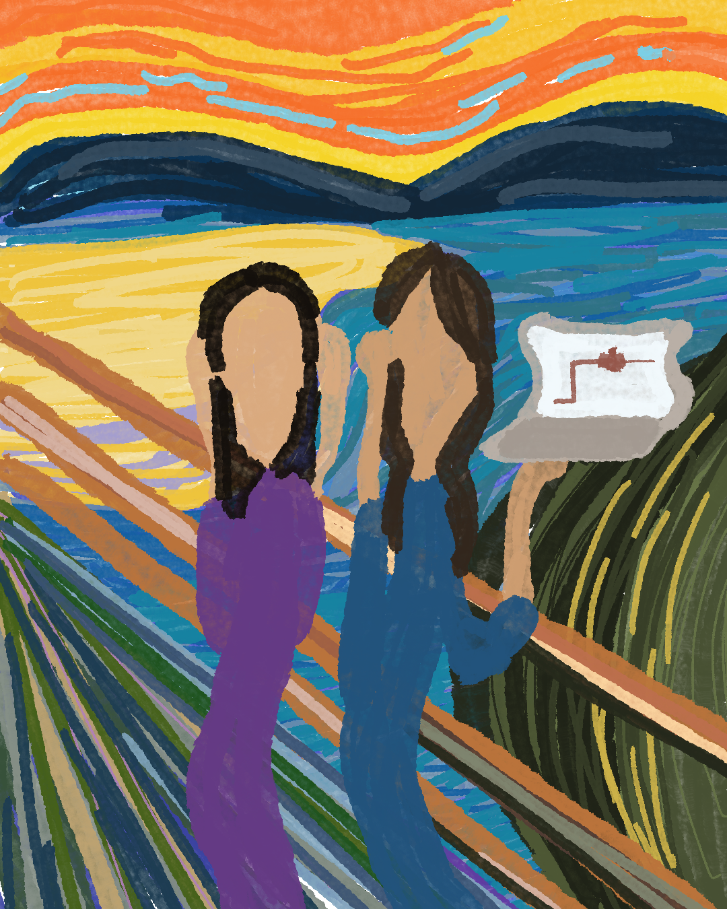
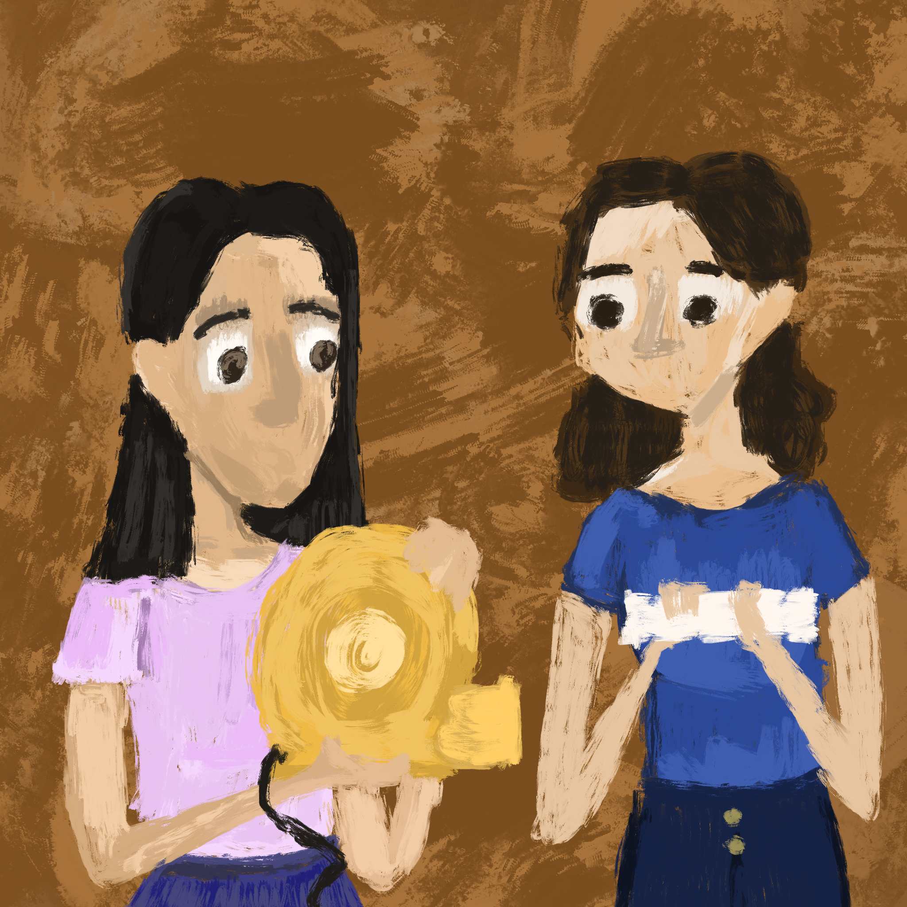
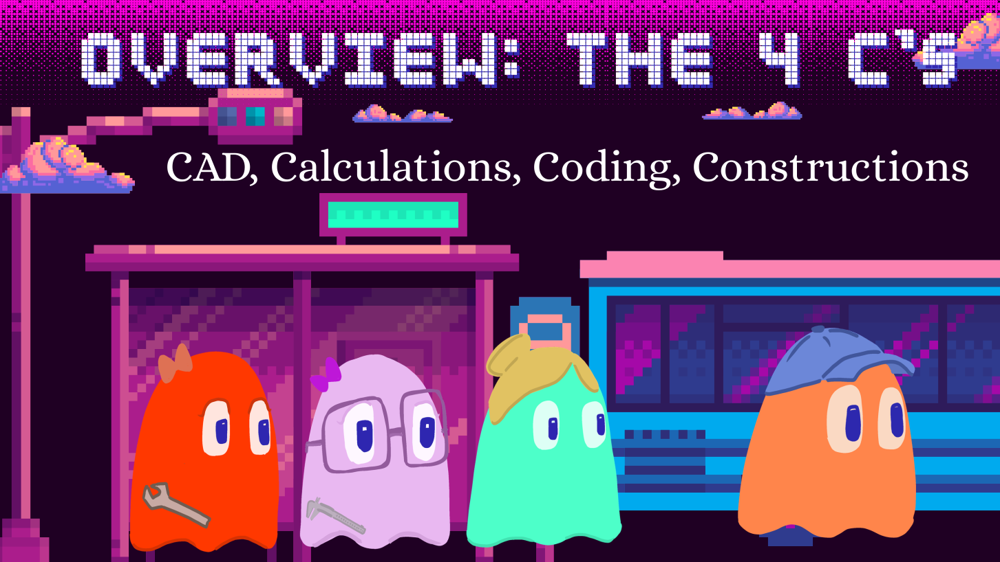
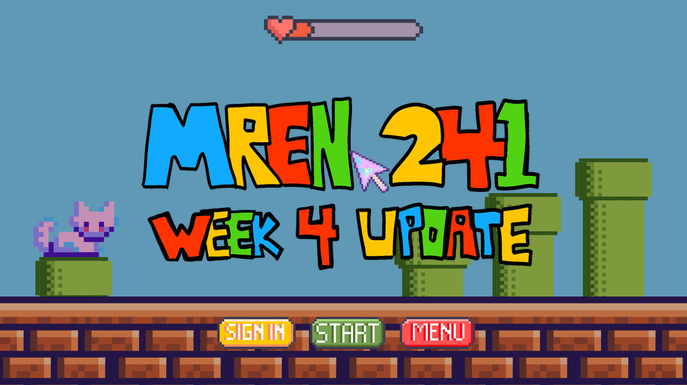
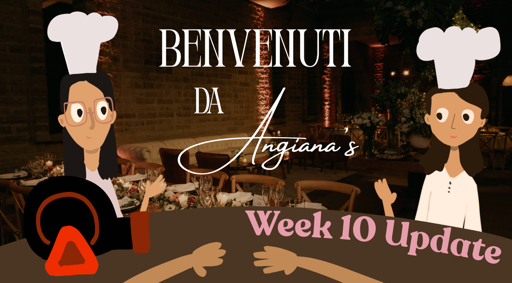

---

## Background

I always said it: there is so much art in engineering!

Over the summer I had the pleasure of working with Eliana and Angie, two outstanding students in the Mechatronics and Robotics Engineering program at Smith Engineering. They were tasked with creating a new lab in which students would design a piping system, simulate the losses with a very COOL new code (with a slick GUI of their creation), and measure losses experimentally using gages and pressure sensors.

Every week we have met for a check-in meeting, and every single time they created the most amazing presentation template. There was a super Mario theme, a pac-man theme, and even a theme inspired by the fine arts.

Thank you both for giving me a smile every Friday (even when flow rate calculations did not add up, or pressure sensors did not work). You **never lost patience**, you **persevered**, and you did all of this with **contagious joy**! 

---
**Enjoy Angian's art ...**

---

