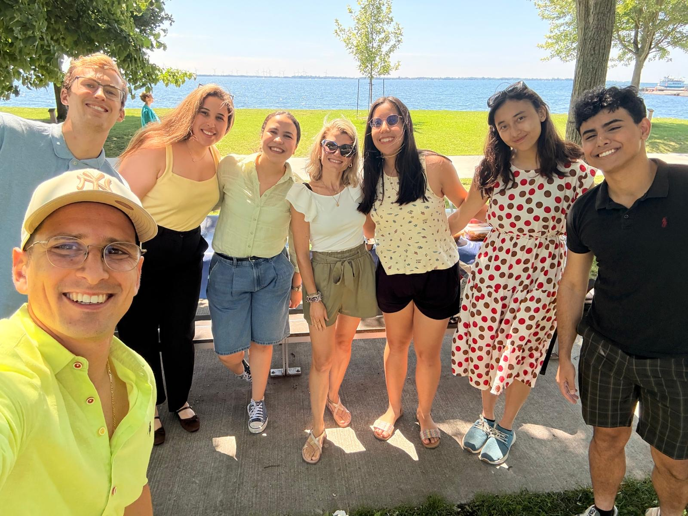
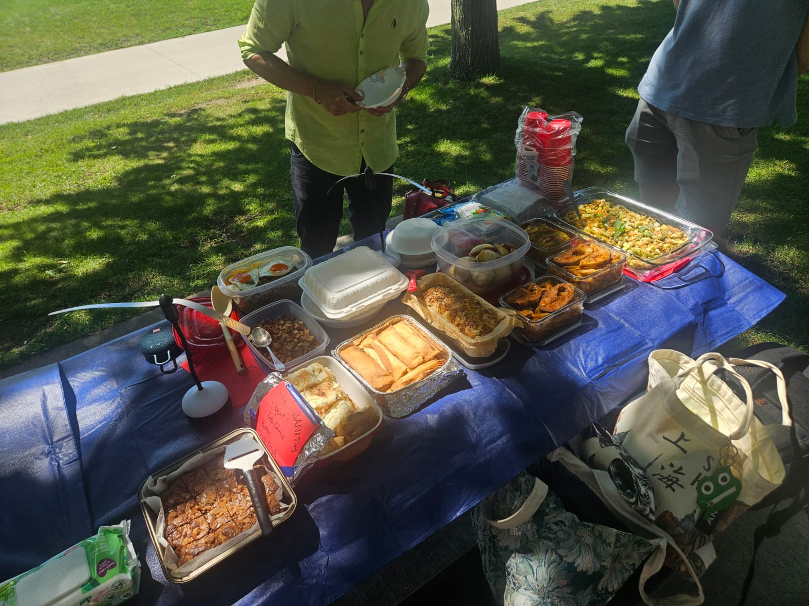
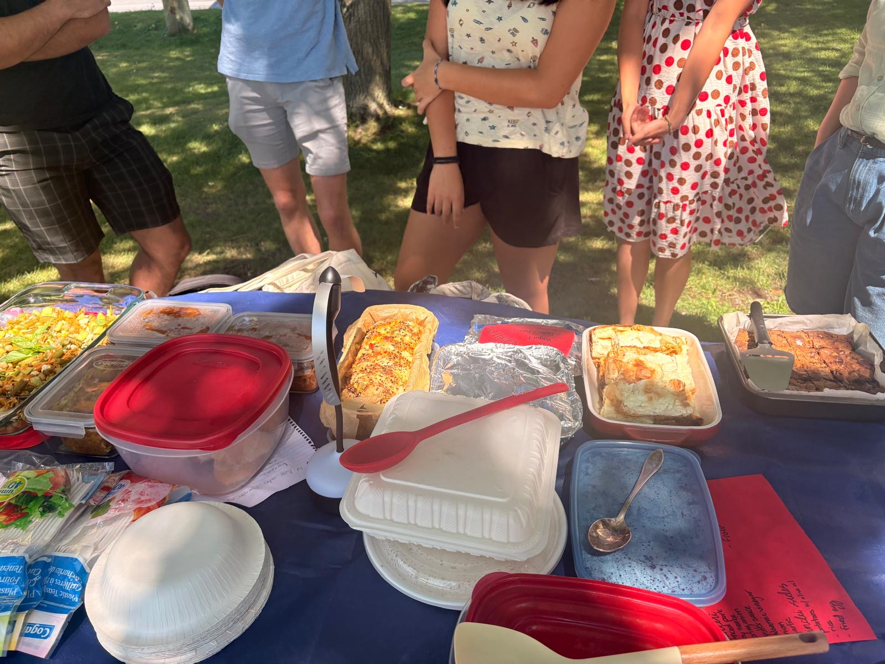
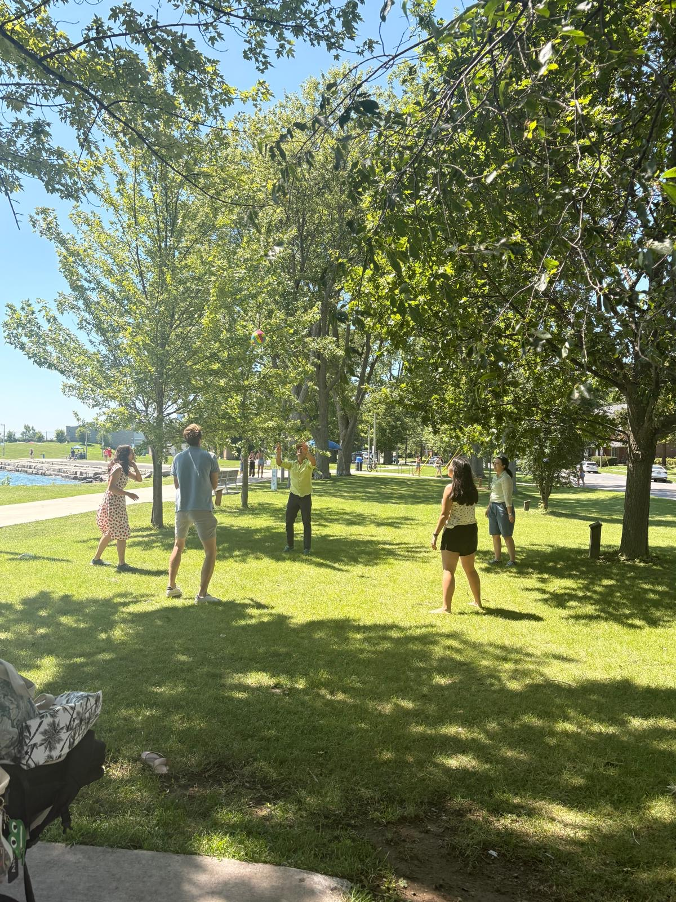

---

## Background

I am always amazed at how FOOD always brings people together with fun and joy!
On August 5th, [FEBUS lab](https://francescoambrogi.github.io/febus-lab/) organized its very first social event!

This summer I was very fortunate to be surrounded by a very international group of fantastic people and everyone brought something special from their family traditions, country, or simply from their list of favorites. We had food from Tunisia, Middle East, Italy, Canada, Macau, and Bulgaria.

Like a true Italian all I could think about was what my late Nonna Ada used to say in front of a good selection of delicious dishes: "Pancia mia fatti capanna". The literal translation in English is "My belly, make yourself a hut [or cabin for Canadians]" or even better "Let's dig in!".

It was a wonderful afternoon filled with joy, laughter, and happiness to celebrate the great work all members did over the summer.
I am honestly humbled and amazed by the skills and talent of the new generation of young professionals!

**THANK YOU** everyone, and keep feeding your curiosity!

---

