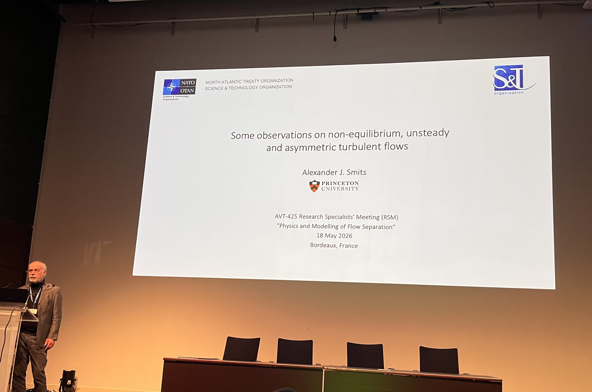
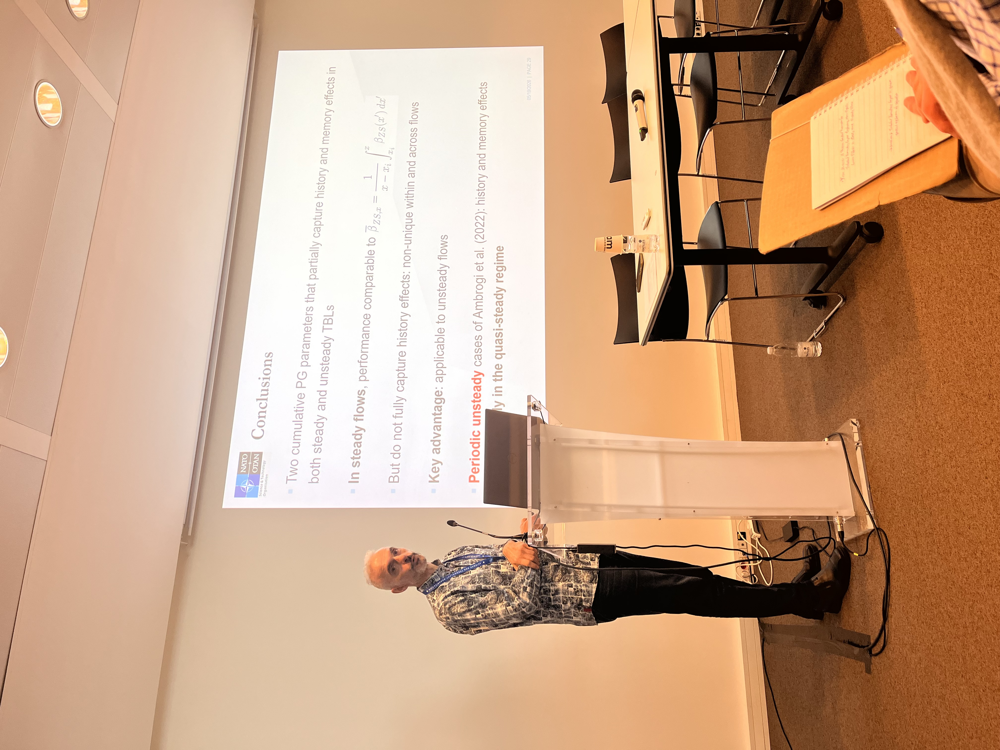
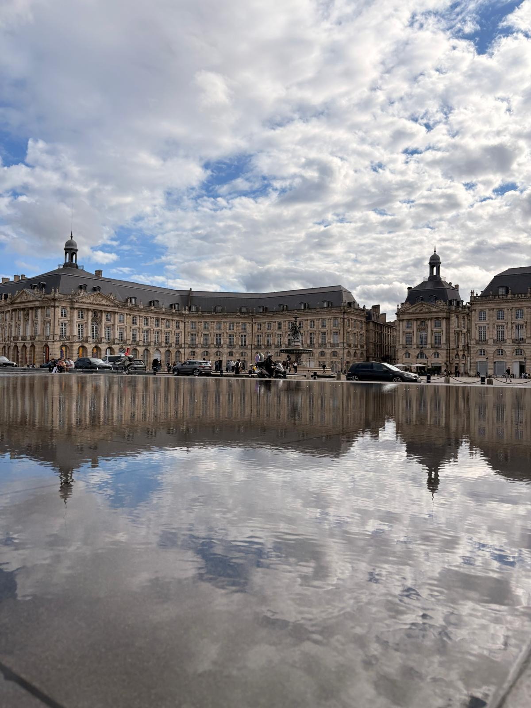
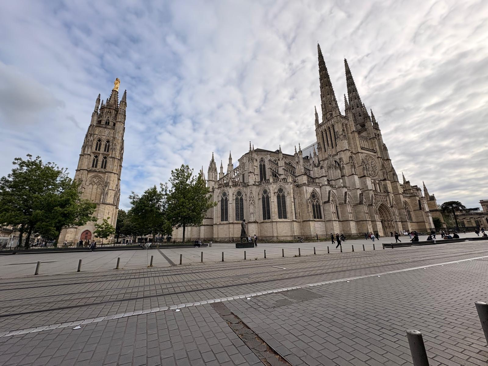

---

## Background

*Image 1: Professor Alexander Smits giving the opening remarks*

I had the pleasure of attending the NATO Applied Vehicle Technology (AVT) Research Specialist Meeting in Bordeaux, France.

The focus was on the **physics and modeling of flow separation**, and the meeting gathered outstanding researchers across the globe. What I found extremely enlightening was the amount of brilliant discussions from two worlds sometimes VERY far from each other: experiments and numerical simulations.

The organizers (shoutout to Prof [Teresa Saxton-Fox](https://aerospace.illinois.edu/directory/profile/tsaxtonf) and [Prof David Rival](https://www.tu-braunschweig.de/en/ism/staff/prof-dr-ing-david-e-rival)!) did an amazing job at planning the meeting such that speakers had enough time to explain the problem and present results, and leave lots of space for open (and often very insightful!!) discussions on the broader level.

*Image 2: Professor Yvan Maciel presenting*

Not only I had the chance of learning from the **Giants of fluid mechanics**, but also absorb the perspectives of both worlds in complex areas of physics such as flow separation.

Truly grateful to be part of this group, and I look forward to a continued fruitful conversation! 

**Thank you everyone!**

---

**PS** Bordeaux was absolutely amazing! I had a blast exploring this very cute, European gem ...

---

