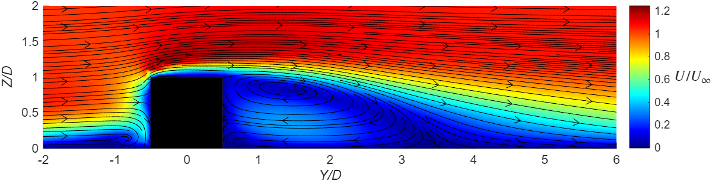

---

### Short bio:

Kellan is a curiosity-driven self-motivated student in the department of Mechanical and Materials Engineering at Smith Engineering. As of May 1st 2026, Kellan joined the FEBUS lab as a MASc student and will work under the supervision of Prof. Francesco Ambrogi and Prof. Barbara da Silva.

### Project:

Kellan's research focuses on studying the hydrodynamic function of sharkskin denticles using advanced Computational Fluid Dynamics (CFD) tools. As a first step, he has completed a careful preliminary study of the flow over a surface-mounted circular cylinder and successfully matched key results from the literature, validating his numerical approach. Building on this foundation, Kellan will employ Large-Eddy Simulation (LES) techniques to resolve the complex turbulent structures associated with sharkskin-inspired surfaces, leveraging high-performance computing resources provided by the Research Alliance Canada.

*Figure 1: steamwise velocity contours overlayed with streamlines for the validation case ran by Kellan for his MECH461 project.*

---
