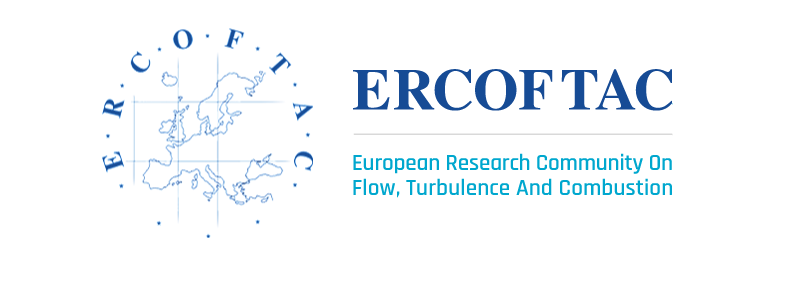

---

##### Abstract

In the present paper we use large-eddy simulations to investigate a spatially developing turbulent boundary layer with a space- and time-dependent pressure gradient. By changing the freestream velocity periodically in time we generate a flow field that can either separate or tend towards re-laminarization, depending on the phase of the cycle. Several cases have been investigated for a range of reducednfrequencies $k$, spanning between a very rapid flutter-like motions to a slower quasi-steady flapping. Time-averaged andphase-averaged fields are analyzed, and comparison is made with steady cases with fixed pressure gradients. In the following, we briefly describe the methodology and show some preliminary results. We will conclude by outlining the results that will be presented in the final paper.

---

##### Figure 1: DLES 13.



---

##### Citation

```latex
@InProceedings{10.1007/978-3-031-47028-8_1,                                           
 author="Ambrogi, F. and Piomelli, U. and Rival, D. E.",
 editor="Marchioli, Cristian and Salvetti, Maria Vittoria and Garcia-Villalba, Manuel and Schlatter, Philipp",
 title="Dynamics of Turbulent Kinetic Energy Advection in a Turbulent Boundary Layer Under Unsteady Pressure Gradients",
 booktitle="Direct and Large Eddy Simulation XIII",
 year="2024",
 publisher="Springer Nature Switzerland",
 address="Cham",
 pages="3--8",
}

```

---
