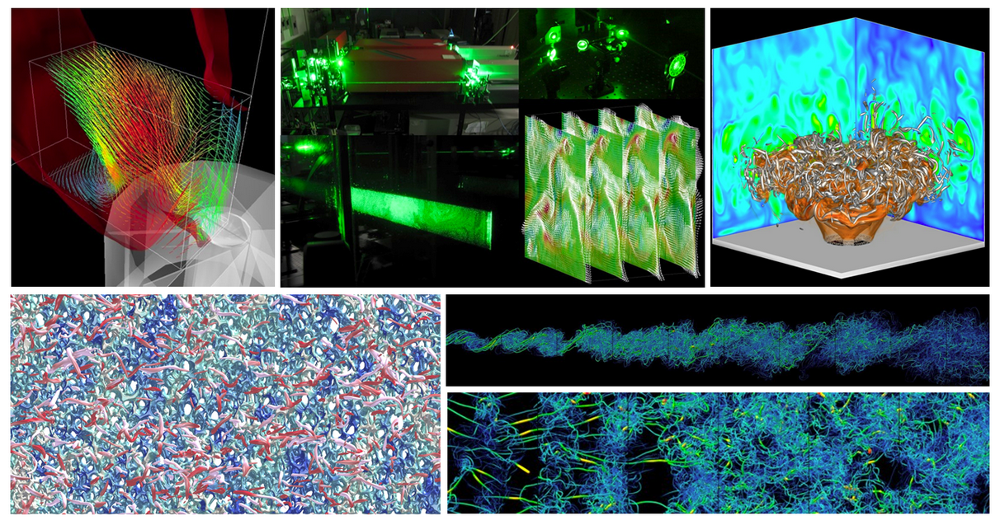

---

##### Abstract

We use large-eddy simulations to investigate a spatially developing turbulent boundary layer with a space- and time-dependent pressure gradient. The free-stream velocity is prescribed, and the flow oscillates between times in which a favorable pressure gradient is followed by an adverse one, a zero pressure gradient, and a period in which the adverse pressure gradient is followed by a favorable one. The alternating favorable and adverse pressure gradient causes the flow to periodically separate and reattach from the wall. Several cases have been investigated for a range of reduced frequencies $k$ spanning the range between very rapid flutter-like motions to slower flapping. Time-averaged and phase-averaged fields are analyzed, and comparison is made with steady cases with fixed pressure gradients.

---

##### Figure 1: TSFP-12.



---

##### Citation

```latex
@inproceedings{ambrogi2022,                                                           
 title={Large-eddy simulations of a turbulent boundary layer with unsteady pressure g    radients},
 author={Ambrogi, Francesco and Piomelli, Ugo and Rival, David},
 booktitle={TSFP12},
 year={2022}
}

```

---
