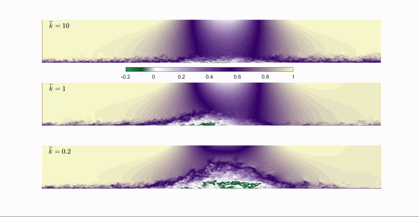

---

##### References

+ [Ambrogi et al. 2024 - AIAAJ](https://arc.aiaa.org/doi/abs/10.2514/1.J064382)
+ [Ambrogi et al. 2023 - JFM](https://www.cambridge.org/core/services/aop-cambridge-core/content/view/903D02271CE967B9EB73F26D88623C84/S0022112023006900a.pdf/characterisation_of_unsteady_separation_in_a_turbulent_boundary_layer_reynolds_stresses_and_flow_dynamics.pdf)
+ [MacDougall et al. 2023 - Fluids](https://www.mdpi.com/2311-5521/8/10/273)
+ [Ambrogi et. al 2022 - JFM](https://www.cambridge.org/core/services/aop-cambridge-core/content/view/25802765C211036318F556F5DF29F46E/S0022112022005614a.pdf/characterization_of_unsteady_separation_in_a_turbulent_boundary_layer_mean_and_phaseaveraged_flow.pdf)

---

##### Abstract

Both in nature and industrial applications, turbulent boundary layers in which the pressure gradient varies both in space and time are extremely common. On an airfoil, for instance, the variation of angle of attack induces unsteadiness in the pressure gradient which greatly affects the flow physics and the airfoil behavior. The fast-changing body curvature of a shark swimming and maneuvering generates strong pressure gradients which, of course, are space and time dependent. Numerical simulation of such case studies is extremely important to increase our physical understanding of separated flows and improve future modeling capabilities.

---

##### Background:

In the present project, the large eddy simulation (LES) technique is used to investigate a turbulent boundary layer under unsteady pressure gradient generated by imposing a suction-blowing velocity profile at the top boundary. The adverse pressure gradient is strong enough to generate a separated flow. The non dimensional parameter which characterizes the unsteadiness is the reduced frequency $\tilde{k}$ defined as:

$$
\tilde{k}=\frac{\pi f L_{PG}}{U_o}
$$

Where $f$  is the imposed frequency, $L_{PG}$ is the length over which the pressure gradient varies, and $U_o$ is the free-stream velocity at the inflow plane. Several cases have been investigated over a range of reduced frequency and compared with the steady cases at the same pressure gradient. The animation above shows contours of instantaneous streamwise velocity $u$ through the cycle for 3 reduced frequencies ($\tilde{k}=0.2,1,10$).

Simulations are performed using a well validated code, with second order differences for all terms, semi-implicit time advancement, and MPI parallelization. The unresolved stresses are modeled using the Vreman eddy viscosity model. The animation clearly shows the differences between the two cases: when $\tilde{k}$ is high enough the separation bubble does not have time to develop, yet the size of the separation region is comparable to a steady case. When $\tilde{k}$ decreases, the extent of the separation bubble in the wall normal direction increases but the length of the separation region is reduced compared with the steady case. The main findings so far include:

+ Large histeresis effects. The flow history seems to play a relevant role in the near-wall flow physics.
+ Advection of the turbulent separation bubble. When the convective timescale of the flow, and the unteady imposed one are equal ($\tilde{k}=1$), the separation region is unstable and is periodically advected out of the domain at constant speed.
+ The advection mechanism of the TSB is independent on the freestream forcing distribution, and only related to the occurrence of reattachement at the wall.

---

