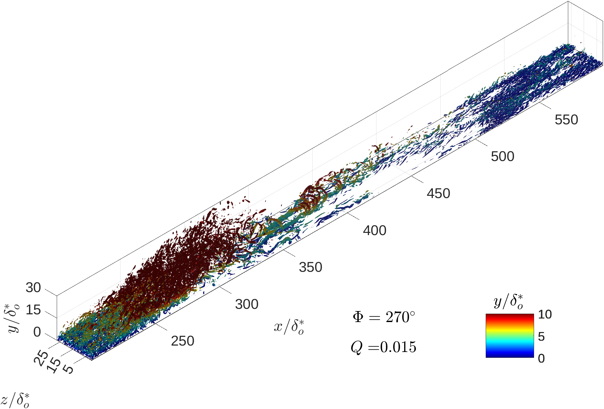

---

##### References

+ [Ambrogi et al. 2024 - AIAAJ](https://arc.aiaa.org/doi/abs/10.2514/1.J064382)
+ [Ambrogi et al. 2023 - JFM](https://www.cambridge.org/core/services/aop-cambridge-core/content/view/903D02271CE967B9EB73F26D88623C84/S0022112023006900a.pdf/characterisation_of_unsteady_separation_in_a_turbulent_boundary_layer_reynolds_stresses_and_flow_dynamics.pdf)
+ [MacDougall et al. 2023 - Fluids](https://www.mdpi.com/2311-5521/8/10/273)
+ [Ambrogi et. al 2022 - JFM](https://www.cambridge.org/core/services/aop-cambridge-core/content/view/25802765C211036318F556F5DF29F46E/S0022112022005614a.pdf/characterization_of_unsteady_separation_in_a_turbulent_boundary_layer_mean_and_phaseaveraged_flow.pdf)

---

##### Abstract

This project has the goal of furthering our understanding of the physics of separated turbulent boundary layers. By leveraging the power of modern flow visualiztion techniques, and by using an extensive dataset of wall-resolved large-eddy simulations of unsteady separated TBLs, we plan on studying large-scale coherent structures. These structures are of pivotal importance for the transport of any quantity (mass, momentum, enery, and contaminant) in a turbulent flow. Therefore, characterizing the behavior of these structures under a time-dependent pressure gradint will shed light into several engineering applications such as turbulent mixing, heat diffusion, or the transport of a contaminant in the atmosphere.

---

##### Background:

---

