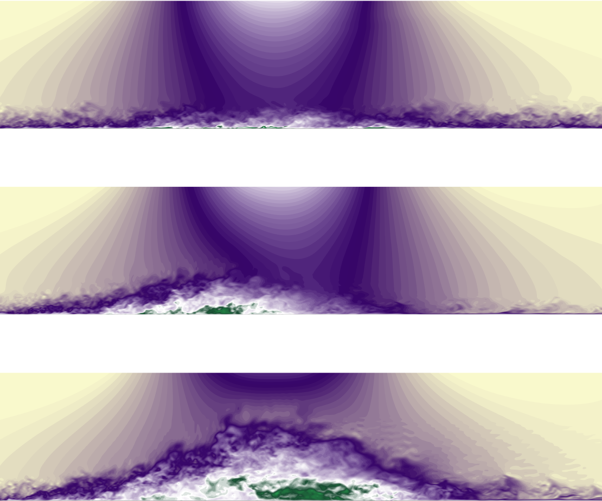

---

##### Abstract

A spatially developing turbulent boundary layer subject to a space- and time-dependent pressure gradient is analysed via large-eddy simulation. The unsteadiness is prescribed by imposing an oscillating suction–blowing velocity profile at the top boundary of the computational domain. The alternating favourable and adverse pressure gradients cause the flow to separate and reattach to the wall periodically. A range of reduced frequencies $k$ was investigated, spanning from a very rapid flutter-like motion to a slow, quasi-steady flapping. The Reynolds number based on the boundary-layer displacement thickness $\delta_o^\star$ at the inflow plane is $Re^\star=1000$. Both time- and phase-averaged fields are analysed and results are compared with steady conditions. The reduced frequency $k$ has a significant effect on the transient flow-separation process. For high $k$ the separation bubble does not grow as thick as in the corresponding steady case, but the length of the bubble remains comparable; hysteresis is observed in the near-wall region. As $k$ is reduced, a threshold is met at which the separation bubble grows in the wall-normal direction. However, the length of the bubble is significantly reduced again when compared with the steady case. At this frequency, the region of slow-moving fluid generated by the flow reversal is advected downstream, causing a decorrelation between the forcing (the imposed free-stream velocity) and the velocity and pressure downstream of the separation bubble. Moreover, hysteresis effects are shifted away from the wall. At the lowest frequency a quasi-steady solution is approached; however, transient effects are still present in the backflow region.

---

##### Figure 1: Instantaneous streamwise velocity $u$ for the three cases described in the paper.



---

##### Citation

```latex
@article{ambrogi_piomelli_rival_2022,                                                 
 title={Characterization of unsteady separation in a turbulent boundary layer: mean and phase-averaged flow},
 volume={945},
 DOI={10.1017/jfm.2022.561},
 journal={Journal of Fluid Mechanics},
 publisher={Cambridge University Press},
 author={Ambrogi, Francesco and Piomelli, U. and Rival, D.E.},
 year={2022},
 pages={A10}
}
```

---
