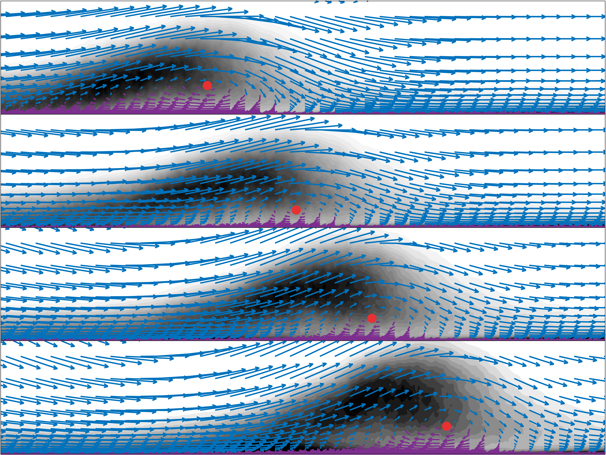

---

##### Abstract

The large-eddy simulation technique was used to investigate the dynamics of unsteady flow separation on a flat-plate turbulent boundary layer. The unsteadiness was generated by imposing an oscillating, wall-normal velocity profile at the top of the computational domain, and a range of reduced frequencies ($k$), from a very rapid flutter-like motion to a slow quasi-steady oscillation, was studied. Ambrogi et al. [J. Fluid Mech. 945, A10, 2022] showed that the reduced frequency greatly affects the transient separation process, and at a frequency $k = 1$, the separation region became unstable and was advected periodically out of the domain. In this paper we will discuss the causes of the observed advection process and the effects of the unsteadiness on the second moments. The time evolution of turbulent kinetic energy, for instance, reveals that an advection-like phenomenon is also present at a very low reduced frequency, but its dynamic behaviour is completely different from that of the intermediate frequency ($k = 1$). At the intermediate frequency the entire recirculation region is advected downstream, keeping its shape. The advected structure is rotational in nature, and moves at constant speed. In contrast, in the low- frequency case the advected fluid originates at the reattachment point, and the structure is shear-dominated. Particle pathlines reflect the fact that the flow at the low frequency is quasi-steady-state, but show peculiar differences at the intermediate frequency, in which the flow response to the freestream forcing depends on the particle positions in the wall-normal direction.
---

##### Figure 1: Phase-averaged turbulent kinetic energy overlaid with vectors representing the relative velocity field of the advecting structure.



---

##### Citation

```latex
@article{ambrogi_piomelli_rival_2023,                                                 
 title={Characterisation of unsteady separation in a turbulent boundary layer: Reyno    lds stresses and flow dynamics},
 author={Ambrogi, Francesco and Piomelli, Ugo and Rival, David E.},
 year={2023},
 journal={Journal of Fluid Mechanics},
 publisher={Cambridge University Press},
 volume={972},
 pages={A36},
 DOI={10.1017/jfm.2023.690}
}
```

---
