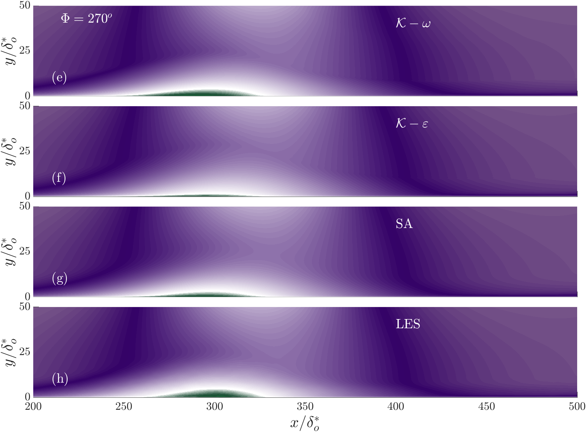

---

##### Abstract

Unsteady separation is a phenomenon that occurs in many flows and results in increased drag, decreased lift, noise emission, and loss of efficiency or failure in flow devices. Turbulence models for the steady or unsteady Reynolds-Averaged Navier-Stokes equations (RANS and URANS, respectively) are commonly used in industry; however, their performance is often unsatisfactory. The comparison of RANS results with experimental data does not clearly isolate the modelling errors, since differences with the data may be due to a combination of modelling and numerical errors, and also to possible differences in the boundary conditions.  In the present study we us high-fidelity Large-Eddy Simulation (LES) results to carry out a consistent evaluation of the turbulence models.  By using the same numerical scheme and boundary conditions as the LES, and a grid on which grid convergence was achieved, we can isolate modelling erors. The calculations (both LES and RANS) are carried out using a well-validated, second-order accurate code. Separation is generated by imposing a freestream velocity distribution, that is modulated in time.  We examined three frequencies (a rapid, flutter-like oscillations, an intermediate one in which the forcing and the flow have the same timescales, and a quasi-steady one).  We also considered three different pressure distributions, one with alternating Favourable and Adverse Pressure Gradients (FPG and APG, respectively), one oscillating between an APG and a zero-pressure gradient (ZPG) and one with an oscillating APG.}  All turbulence models capture the general features of this complex unsteady flow as well or better than in similar steady cases. The presence, during the cycle, of times in which the freestream pressure gradient is close to zero affects significantly the model performance. Comparing our results with those in the literature indicates that numerical errors due to the type of discretization and to the grid resolution are as significant as those due to the turbulence model.

---

##### Figure 1: FLUIDS.



---

##### Citation

```latex
@Article{fluids8100273,
AUTHOR = {MacDougall, Claire Yeo and Piomelli, Ugo and Ambrogi, Francesco},
TITLE = {Evaluation of Turbulence Models in Unsteady Separation},
JOURNAL = {Fluids},
VOLUME = {8},
YEAR = {2023},
NUMBER = {10},
ARTICLE-NUMBER = {273},
URL = {https://www.mdpi.com/2311-5521/8/10/273},
ISSN = {2311-5521},
}
```

---
